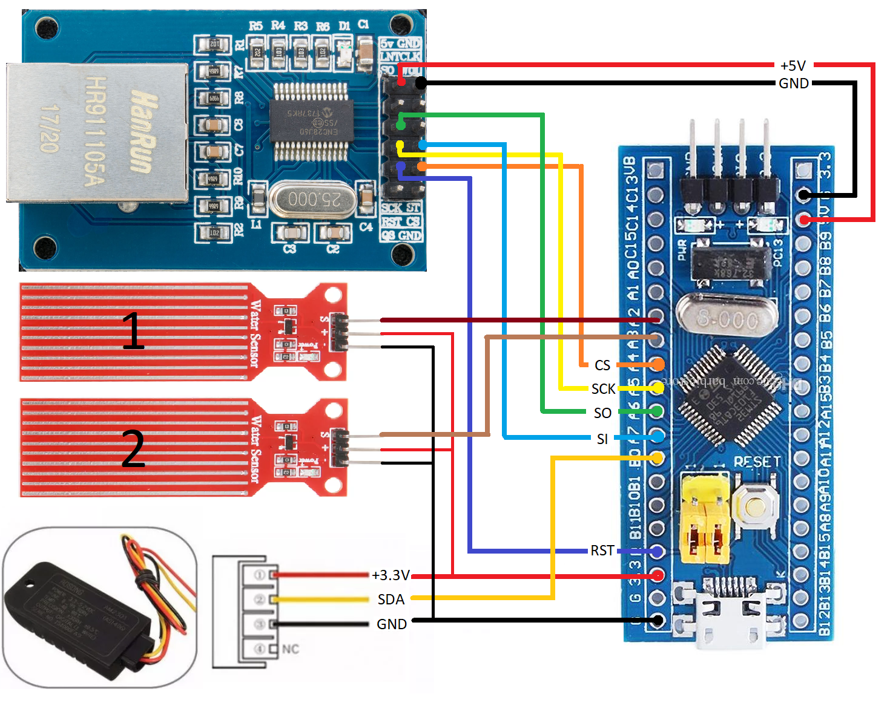

# SNMP-Sensor-DHT21

Humidity and temperature sensor for server room.

Works on SNMP and HTTP protocols

Platform: PlatformIO Home 3.0.1·Core 4.1.0

The configuration in the file **include/config.h**

### Сomponents:

    1. STM32F103 Blue Pill
    2. Ethernet shield enc28j60
    3. Sensor DHT21

### Schematic:


### SNMP:

#### Get list
snmpwalk -v 1 -c public 192.168.35.200

snmpwalk -v 1 -c public 192.168.35.200 1.3.6.1.4.1.36582

##### Get temperature сelsius:

###### request:
snmpget -d -v 1 -r 1 -c public 192.168.35.200 1.3.6.1.4.1.36582.1.0

###### response:
```
0000: 30 2B 02 01  00 04 06 70  75 62 6C 69  63 A0 1E 02    0+.....public...
0016: 04 3F B8 4A  9E 02 01 00  02 01 00 30  10 30 0E 06    .?.J.......0.0..
0032: 0A 2B 06 01  04 01 82 9D  66 01 00 05  00             .+......f....


Received 53 byte packet from UDP: [192.168.35.200]:161->[0.0.0.0]:38807
0000: 30 33 02 01  00 04 06 70  75 62 6C 69  63 A2 26 02    03.....public.&.
0016: 04 3F B8 4A  9E 02 04 00  00 00 00 02  04 00 00 00    .?.J............
0032: 00 30 12 30  10 06 0A 2B  06 01 04 01  82 9D 66 01    .0.0...+......f.
0048: 00 02 02 06  0E                                       .....

iso.3.6.1.4.1.36582.1.0 = INTEGER: 1550
```
##### Get humidity %:

###### request:
snmpget -d -v 1 -r 1 -c public 192.168.35.200 1.3.6.1.4.1.36582.2.0

###### response:
```
Sending 45 bytes to UDP: [192.168.35.200]:161->[0.0.0.0]:0
0000: 30 2B 02 01  00 04 06 70  75 62 6C 69  63 A0 1E 02    0+.....public...
0016: 04 20 02 B7  2A 02 01 00  02 01 00 30  10 30 0E 06    . ..*......0.0..
0032: 0A 2B 06 01  04 01 82 9D  66 02 00 05  00             .+......f....


Received 53 byte packet from UDP: [192.168.35.200]:161->[0.0.0.0]:33548
0000: 30 33 02 01  00 04 06 70  75 62 6C 69  63 A2 26 02    03.....public.&.
0016: 04 20 02 B7  2A 02 04 00  00 00 00 02  04 00 00 00    . ..*...........
0032: 00 30 12 30  10 06 0A 2B  06 01 04 01  82 9D 66 02    .0.0...+......f.
0048: 00 02 02 0A  64                                       ....d

iso.3.6.1.4.1.36582.2.0 = INTEGER: 2660
```

##### Get heat index сelsius:

###### request:
snmpget -d -v 1 -r 1 -c public 192.168.35.200 1.3.6.1.4.1.36582.3.0

###### response:
```
Sending 45 bytes to UDP: [192.168.35.200]:161->[0.0.0.0]:0
0000: 30 2B 02 01  00 04 06 70  75 62 6C 69  63 A0 1E 02    0+.....public...
0016: 04 50 73 52  F9 02 01 00  02 01 00 30  10 30 0E 06    .PsR.......0.0..
0032: 0A 2B 06 01  04 01 82 9D  66 03 00 05  00             .+......f....


Received 53 byte packet from UDP: [192.168.35.200]:161->[0.0.0.0]:41763
0000: 30 33 02 01  00 04 06 70  75 62 6C 69  63 A2 26 02    03.....public.&.
0016: 04 50 73 52  F9 02 04 00  00 00 00 02  04 00 00 00    .PsR............
0032: 00 30 12 30  10 06 0A 2B  06 01 04 01  82 9D 66 03    .0.0...+......f.
0048: 00 02 02 05  39                                       ....9

iso.3.6.1.4.1.36582.3.0 = INTEGER: 1337
```

### HTTP:

http://192.168.35.200

### JSON:

http://192.168.35.200/json/

###### response:
```json
{
    "TemperatureC":16.20,
    "Humidity":25.90,
    "HeatIndexC":14.55
}
```